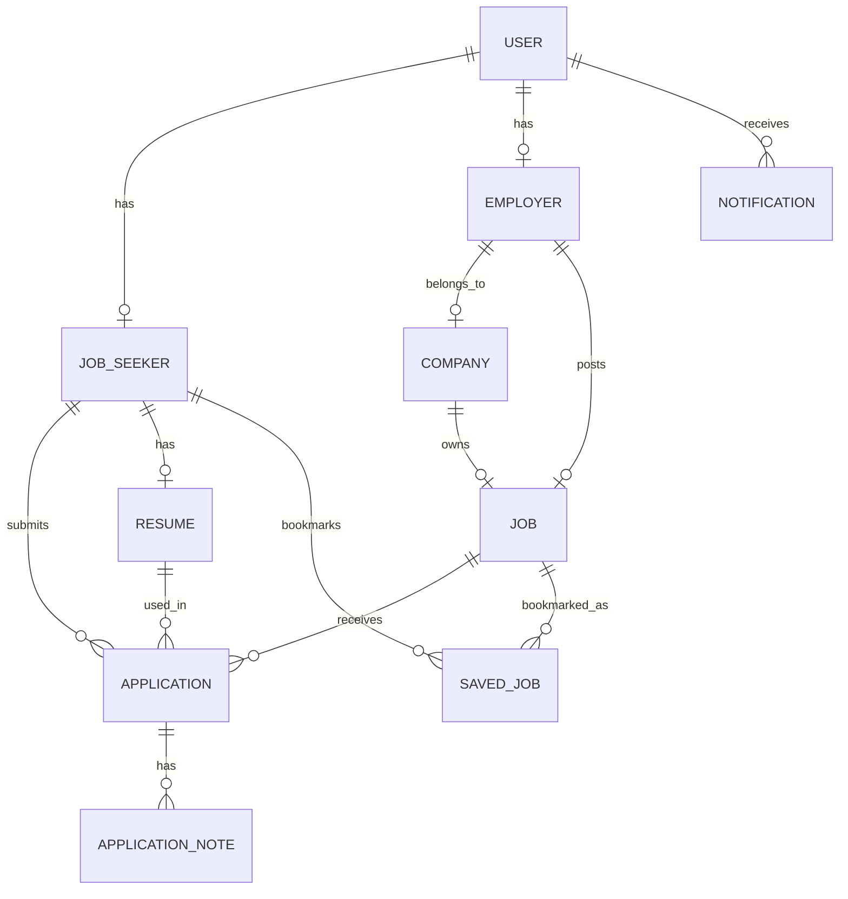
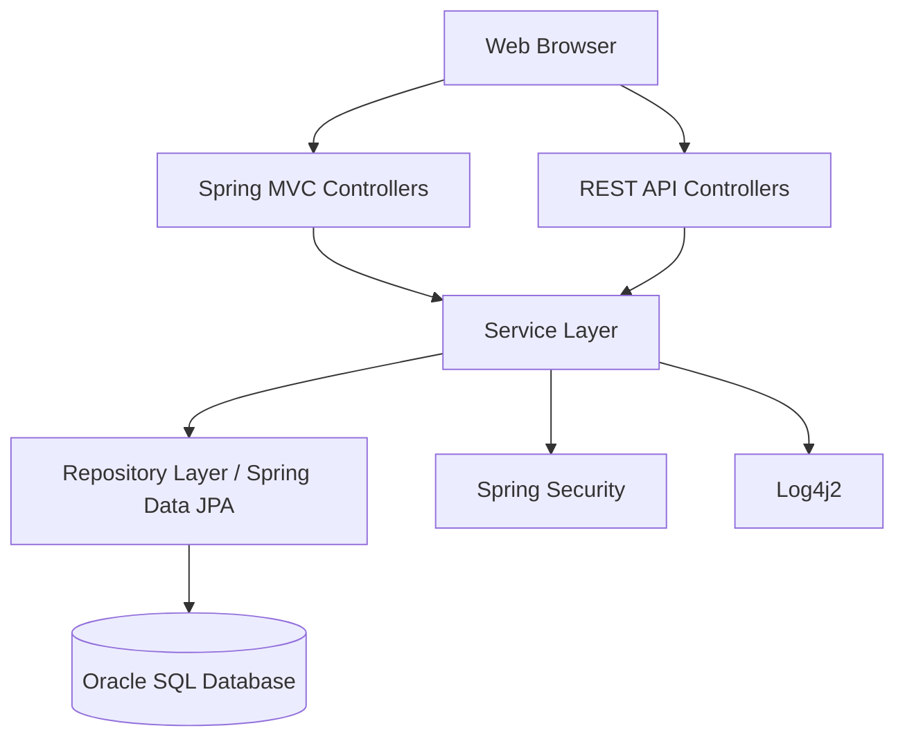
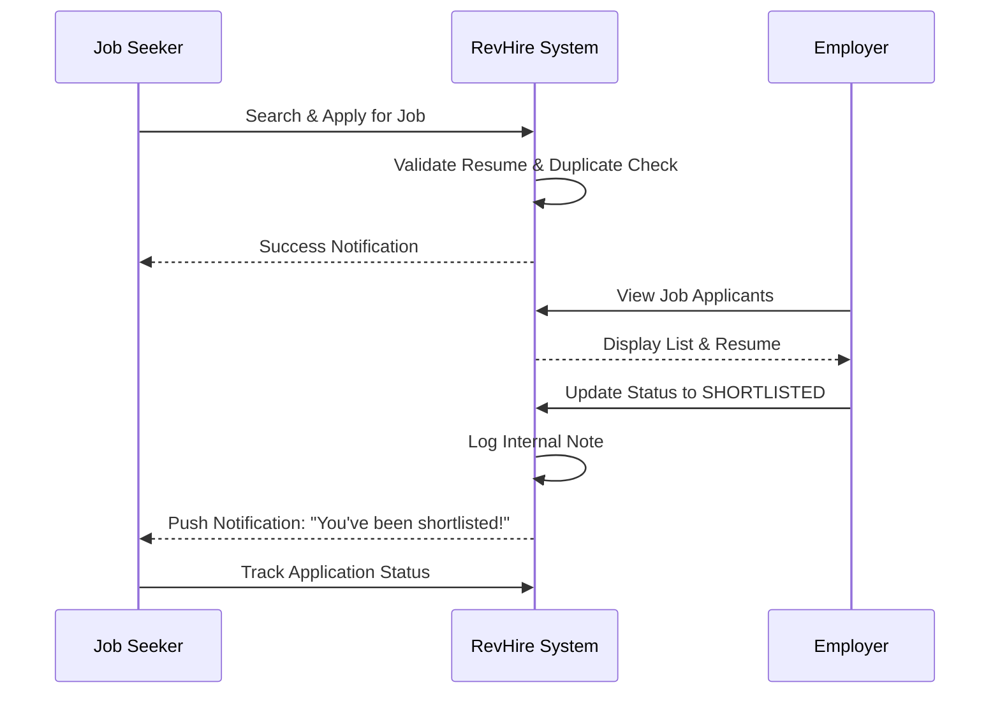

# RevHire Project Documentation

## 1. Entity Relationship Diagram (ERD)

### Table Descriptions
- **Users**: Core credentials and RBAC (ROLE_SEEKER, ROLE_EMPLOYER).
- **JobSeekers**: Personal profiles for candidates.
- **Employers**: Profile for hiring managers.
- **Companies**: Corporate details linked to employers.
- **Jobs**: Job listings with requirements and metadata.
- **Resumes**: Textual data and file paths for candidate profiles.
- **Applications**: Join table for Jobs/Seekers with status and cover letters.
- **ApplicationNotes**: Internal feedback for specific applications.
- **Notifications**: System alerts for users.
- **SavedJobs**: Bookmarks for job seekers.

---

## 2. Application Architecture

### Layer Responsibilities
1.  **View Layer (Thymeleaf/CSS/JS)**: Responsive UI for all user roles.
2.  **Controller Layer**: Handles HTTP requests, manages session/security, and routes to appropriate views.
3.  **Service Layer**: Contains business logic, validation, and transaction management.
4.  **Data Access Layer**: JPA repositories for boilerplate CRUD and custom JPQL queries.
5.  **Security Layer**: Role-based access control and password encryption.

---

## 3. Core Workflow Sequence

